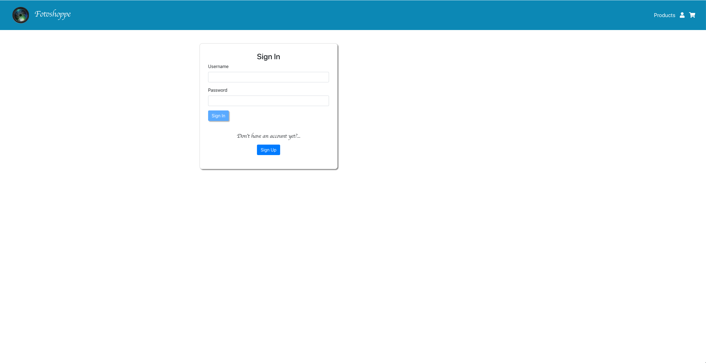

# Fotoshoppe

A photo equipment rental application that is created using MERN (MongoDB, Express, React.js, NodeJS).

## Overview

When the user loads the page, they should be given the option to create an account by signing up and then singning in to the app. The user is also given the option to browse the equipment by page, by category (e.g Camera Body, Lenses, Flashes), or sort the equipment by ascending and descending order. For future development the user will be able to add an item to a wishlist and rent by adding the item/equipment to a cart and checkout.

## Heroku Link

* https://fotoshoppe-916.herokuapp.com/products

#### (PLEASE READ: When deploying the app in heroku, the `SIGN UP, SIGN IN (authentication)` function was not working, but was perfectly running using the `localhost`. It is `HIGHLY RECOMMENDED` to follow carefully the instructions below in order to experience the full functionality of the application.)
___

## Instructions on how to use the application in the LOCAL HOST

* Clone the repository
* Make sure to run `mongodb`
* Open `2 terminals` in your prefered code editor
* In the `1st terminal` cd to `backend` folder (NOTE: NO NEED TO RUN `NPM INSTALL`)
* Run `node seed.js`
* Run `node app.js`
* In the `2nd terminal` cd to `client` folder (NOTE: NO NEED TO RUN `NPM INSTALL`)
* Run `npm start` , the app should automatically open in a browser 
* Now you can enjoy and use the app 
___

___

___

## Technologies Used

* MongodDB
* ExpressJS
* ReactJS
* NodeJS
* Github
* Bootstrap
* Html, CSS, Javascript
* Lodash
* JsonWebToken
* Joi
* Prop-types

